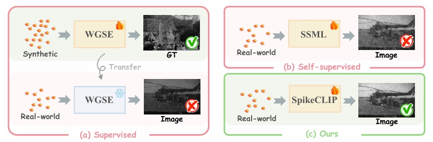
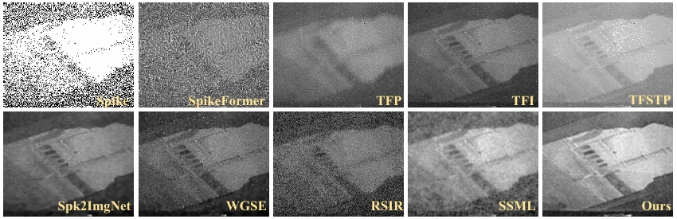

<h2 align="center"> 
  <a href="https://arxiv.org/abs/2501.04477">Rethinking High-speed Image Reconstruction Framework with Spike Camera
</a>
</h2>
<h5 align="center"> 
If you like our project, please give us a star ⭐ on GitHub.  </h5>
<h5 align="center">

</h5>

<p align="center">
  
</p>


## 📕 Abstract
> We introduce a novel spike-to-image reconstruction framework SpikeCLIP that goes beyond traditional supervised training paradigms. Leveraging the CLIP model's powerful capability to align text and images, we incorporate the textual description of the captured scene and unpaired high-quality datasets as the supervision. Our experiments on real-world low-light datasets U-CALTECH and U-CIFAR demonstrate that SpikeCLIP significantly enhances texture details and the luminance balance of recovered images. Furthermore, the reconstructed images are well-aligned with the broader visual features needed for downstream tasks, ensuring more robust and versatile performance in challenging environments.

## 👀 Visual Comparisons
<details open>
<summary><strong>Visual comparison on the U-CALTECH dataset.</strong></summary>
<p align="center">

</details>


## 🕶 Get Started
### 1. Dataset Preparation
The UHSR real-world spike dataset with class label is available for download [here](https://github.com/Evin-X/UHSR), where we split the data such that the range 0-4999 is used as the train dataset, and the remaining data is used as the test dataset.

Overall, the structure of our project is formulated as:
```
<project root>
├── imgs
├── data
│   ├── U-CALTECH
│   │   ├── train
│   │   └── test
│   └── U-CIFAR
│       ├── train
│       └── test
└── evaluate.py
``` 

### 2. Evaluation
* For evaluating our proposed SpikeCLIP on the U-CALTECH dataset, run:
```
python evaluate.py
```

### 3. Comparison
For comparative comparison, please refer to [Spike-Zoo](https://github.com/chenkang455/Spike-Zoo).


## 🤝 Citation
If you find our work useful in your research, please cite:

```
@article{chen2025spikeclip,
  title={Rethinking High-speed Image Reconstruction Framework with Spike Camera
},
  author={Chen, Kang and Zheng, Yajing and Huang, Tiejun and Yu, Zhaofei},
  journal={arXiv preprint arXiv:2501.04477},
  year={2025}
}
```